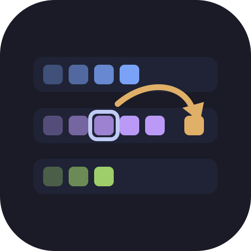
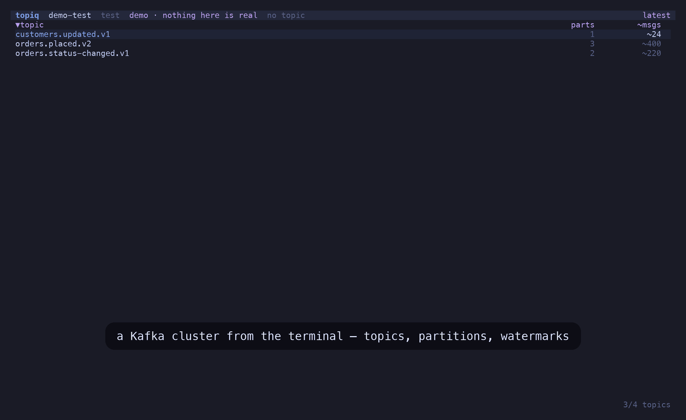
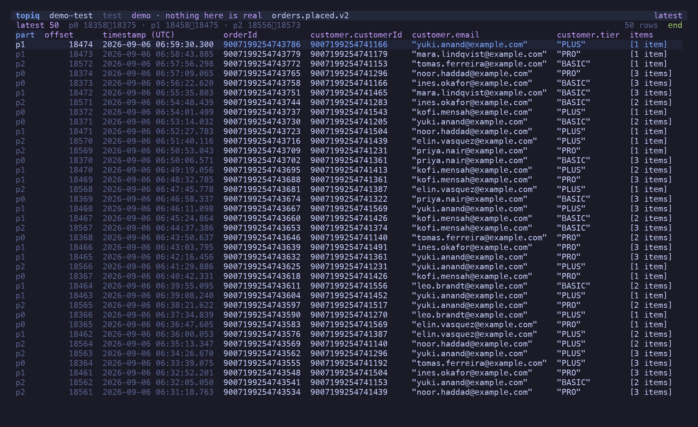
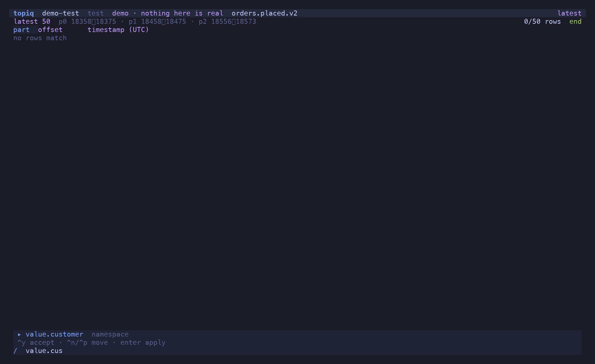
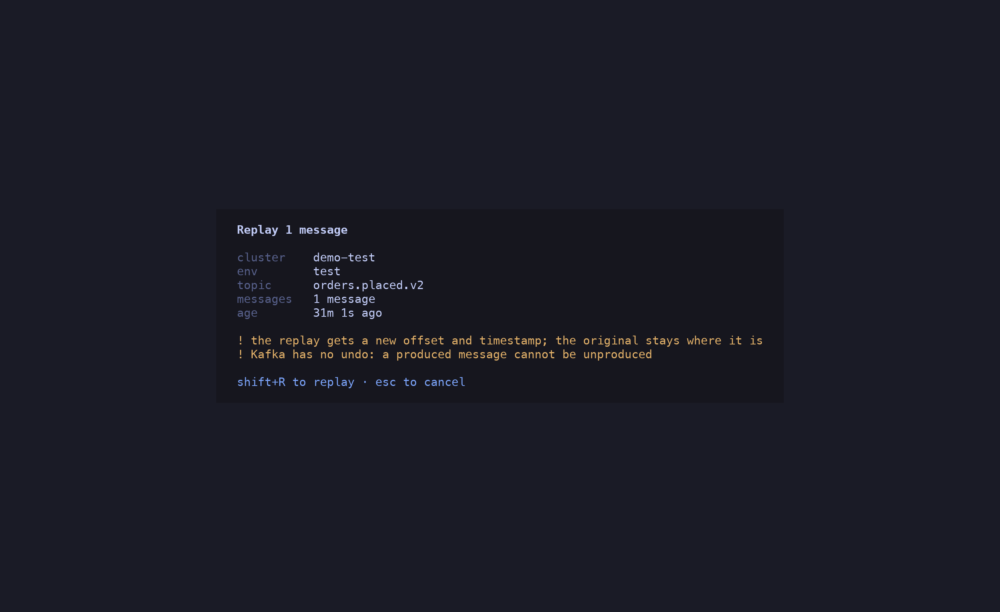

<p align="center">
  
</p>

<h1 align="center">topiq</h1>

<p align="center">Peek, filter, replay. Kafka without leaving the terminal.</p>

<p align="center"><a href="https://candril.github.io/topiq/"><strong>Documentation</strong></a> · <a href="https://candril.github.io/topiq/guide/installation/">Install</a> · <a href="https://candril.github.io/topiq/reference/key-bindings/">Key bindings</a> · <a href="https://candril.github.io/topiq/reference/peek-and-filter/">Peek &amp; filter</a></p>

> [!CAUTION]
> **Spec-driven, AI-generated.** Every feature in topiq starts as a numbered spec in [`specs/`](specs/), and the code and this documentation were generated from those specs with an AI pair. Use it with care: topiq *writes* to Kafka — replay, produce, offset seeks. Every write is off by default per cluster and confirmed at the point of action. Start with `topiq --demo`, then dev and test clusters.

```sh
brew install candril/tap/topiq          # or: nix run github:candril/topiq
topiq --demo                            # an offline demo cluster — no config, no broker
```



---

### A topic that reads like a table

Open a topic and the latest 50 messages are there, newest first, with columns inferred from the decoded payload — nested fields become `customer.tier`, arrays become `[3 items]`. Every Avro `long` is a `BigInt`: an order id above 2^53 is printed exactly, never rounded, which is the console bug this tool was written to not have.



### Filter with a grammar, or with JavaScript

`/` opens the filter bar: `field:value`, `field>x`, ranges, regex literals, negation, nested paths — typed by the field's decoded type. Fields autocomplete from what is loaded, one dotted segment at a time. `=` switches to a raw predicate that runs locally on your own credentials.



### Replay a message — the same bytes

`p` re-produces the message under the cursor: raw key, value and headers, verbatim. No decode, no re-encode, so the embedded schema id stays valid and the bytes are provably identical. `e` edits it in `$EDITOR` first; `⇧N` crafts a new one from the subject's latest schema; `y` copies it to another cluster — decoded here, re-encoded there, and the dialog says so.



### Consumer groups, and the one write with no undo

`c` lists the groups consuming a topic with state, members and per-partition lag — undefined lag is `—`, never `0`. `o` moves a group's offsets to an offset, a timestamp, the beginning or the end, only when the group is `Empty`, checked again at the instant of the write.


---

Full docs: **[candril.github.io/topiq](https://candril.github.io/topiq/)**

## Install

```sh
brew install candril/tap/topiq
```

```sh
nix run github:candril/topiq              # try it; `nix profile install github:candril/topiq` keeps it
```

```sh
curl -fsSL https://raw.githubusercontent.com/candril/topiq/main/scripts/install.sh | bash
```

All three install the same binary — the one attached to the latest
[release](https://github.com/candril/topiq/releases), verified against its `SHA256SUMS` — prebuilt
for macOS (Apple Silicon, Intel) and Linux (x64, arm64). The installer puts it in `/usr/local/bin`;
`TOPIQ_INSTALL_DIR=~/.local/bin` moves it, `TOPIQ_VERSION=0.1.0` pins it.

From source, with [Bun](https://bun.sh): `git clone https://github.com/candril/topiq.git && cd topiq && bun install && just install-bin`.

## Configure

Cluster profiles live in `~/.config/topiq/config.toml`. Copy
[`config.example.toml`](./config.example.toml) and edit — it documents every key.

```toml
[clusters.orders-test]
brokers  = ["kafka-test.example.aivencloud.com:24748"]
registry = "https://kafka-test.example.aivencloud.com:24740"
sasl     = { mechanism = "scram-sha-256", username = "svc-orders" }

# The password is a *command*, run on demand. No secret is ever written to disk.
password_cmd = "az keyvault secret show --vault-name my-vault --name kafka-password --query value -o tsv"

ca_cert      = "~/.config/topiq/aiven-ca.pem"
topic_prefix = "test"
group        = "orders"
env          = "test"
allow_write  = false          # produce and offset writes stay off until you say so
```

Profiles sharing a `group` are environments of one logical cluster, which is what makes
"copy this message to the other environment" a single keystroke.

Connecting slowly, or not at all? `TOPIQ_KAFKA_LOG=/tmp/topiq-kafka.log topiq …` appends
the Kafka client's debug log to that file, secrets redacted, so a stall has a request and a
timestamp next to it.

## What it does

- **Peek** — topic list with watermarks, message table with columns inferred from the
  decoded payload, detail pane with decoded key/value/headers and raw metadata.
- **Filter** — `key:12345 value.IsActive:true value.UpdatedAt>2026-08-01`, with ranges,
  regex and nested fields. `=` switches to a raw JS predicate that runs locally on your
  own credentials.
- **Live tail** — follow a topic with a bounded buffer; filters apply to the stream.
- **Replay** — re-produce a message byte-for-byte, or decode it into `$EDITOR`, edit,
  re-encode against its own schema and produce. Craft a new message from the topic's
  latest schema. Copy across clusters, decoding against the source registry and
  re-encoding against the destination's.
- **Consumer groups** — state, members, per-partition lag; seek a group's offsets to an
  offset, a timestamp, the beginning or the end.

`?` shows every binding. `Ctrl+P` opens the command palette.

## Correctness

Three invariants the tool exists to uphold:

1. **int64 → BigInt everywhere.** An Avro `long` never touches `Number`. Precision loss is
   the console bug topiq was written to not have.
2. **Unmodified replay is byte-exact.** The raw key, value and headers go back out
   verbatim — no decode/re-encode round trip, so the embedded schema id stays valid.
3. **Cross-cluster replay is never byte-exact.** Schema ids are registry-local, so a copy
   must re-encode — and the UI says so rather than silently corrupting a payload.

## The other terminal tools

topiq is one of five, built the same way and installed the same way (`brew install candril/tap/<tool>`, `nix run github:candril/<tool>`, or the curl installer):

- [**lane**](https://candril.github.io/lane/) — Your Jira board, in the terminal. Read it, move it, and never touch the mouse.
- [**monq**](https://candril.github.io/monq/) — Browse, query, edit. MongoDB without leaving the terminal.
- [**presto**](https://candril.github.io/presto/) — Every open PR across the repos you watch, in one list — and whose move it is.
- [**riff**](https://candril.github.io/riff/) — Review the diff where you wrote it: PRs, branches and working-copy changes, with vim motions and inline comments.

## Development

```sh
just run <profile> [topic]   # run it
just check                   # typecheck + lint + format
just test                    # unit tests
just build                   # dist/topiq
```

Specs come before code: [`specs/`](./specs/) is the feature record and
[`PLAN.md`](./PLAN.md) the product rationale.

## License

MIT

---

<p align="center"><sub>One of five terminal tools — one spec-first process, the same three installers:<br><a href="https://candril.github.io/lane/">lane</a> (Jira) · <a href="https://candril.github.io/monq/">monq</a> (MongoDB) · <a href="https://candril.github.io/presto/">presto</a> (pull requests) · <a href="https://candril.github.io/riff/">riff</a> (code review) · <a href="https://candril.github.io/topiq/">topiq</a> (Kafka)</sub></p>
