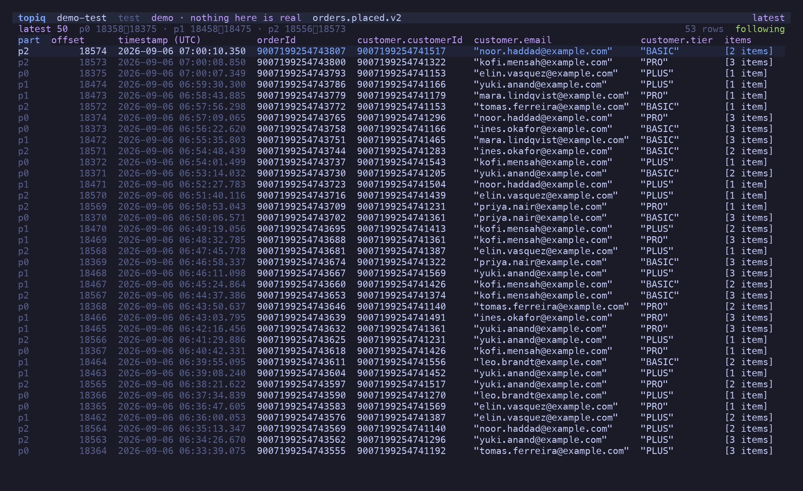
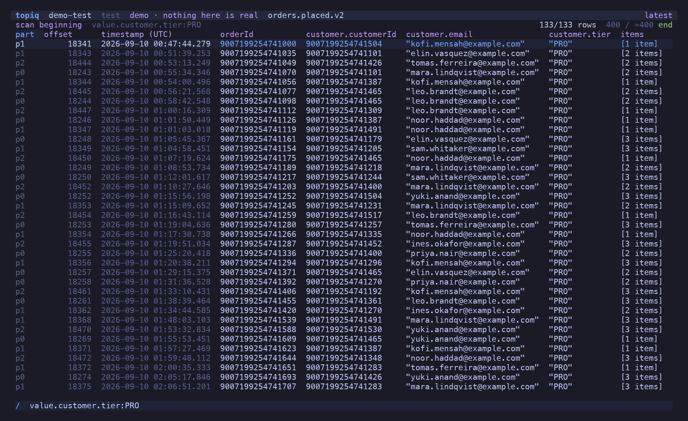
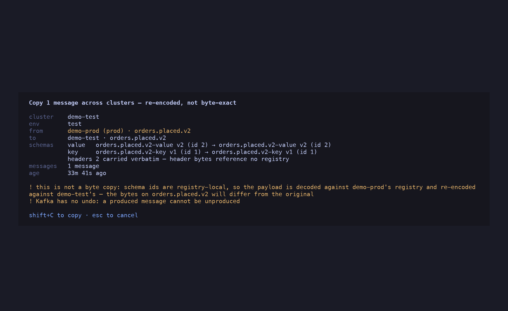

import { CardGrid, Card, Aside } from '@astrojs/starlight/components'

<Aside type="caution">
**Spec-driven, AI-generated.** Every feature in topiq starts as a numbered spec in [`specs/`](https://github.com/candril/topiq/tree/main/specs), and the code and this documentation were generated from those specs with an AI pair. Use it with care: topiq *writes* to Kafka — replay, produce, offset seeks. Every write is off by default per cluster and confirmed at the point of action. Start with `topiq --demo`, then dev and test clusters.
</Aside>

```sh
brew install candril/tap/topiq          # or: nix run github:candril/topiq
topiq --demo                            # an offline demo cluster — no config, no broker
```


## A topic that reads like a table

Open a topic and the latest 50 messages are there, newest first, with columns inferred from
the decoded payload — nested fields become `customer.tier`, arrays become `[3 items]`. Every
Avro `long` is a `BigInt`: an order id above 2^53 is printed exactly, never rounded, which is
the bug this tool was written to not have.


## Filter with a grammar, or with JavaScript

`/` opens the filter bar. `field:value`, `field>x`, ranges, regex literals, negation,
nested paths — typed by the field's decoded type, so `key:12345` matches a BigInt key.
Fields autocomplete from what is actually loaded, one dotted segment at a time.

```text
/ value.customer.tier:PRO value.total>200          two terms, implicit AND
/ value.customer.email:/@example\.com$/            a regex on the rendered value
/ -value.channel:STORE                             negation
```

`=` switches to a raw predicate — `(m) => m.value.items.length > 2` — that runs locally on
your own credentials. No sandbox to fight, no server-side filter language.


## Follow the tail, bounded

`f` follows the topic. Arrivals land at the top; the buffer is capped and every evicted or
dropped row is counted in the header, because a silently truncated tail is a lie about what
the topic contained. `space` pauses without disconnecting.



## Scan past the window

A window holds 10,000 rows at most, and the filter narrows that. `⇧S` turns it around:
every message in the range streams through the filter and only the hits are kept, so
"the order with this id, somewhere in the last four million" is one keystroke after `b`.
The header shows how far the scan got and how fast; `⇧S` again stops it, `esc` returns to
the window. Nothing is dropped on the way — when decoding falls behind, the fetch waits.



## Replay a message — the same bytes

`p` re-produces the message under the cursor to its own topic: the raw key, value and
headers, verbatim. No decode, no re-encode, so the embedded schema id stays valid and the
bytes are provably identical. `e` decodes it into `$EDITOR` first, validates the edit
against the message's own schema, and re-encodes. `⇧N` crafts a new message from the
subject's latest schema.


## Copy across clusters — honestly

`y` copies a message to another cluster. Schema ids are registry-local, so this is *never*
a byte copy: topiq decodes against the source registry, re-encodes against the destination's,
and the dialog names both subjects, both versions and both ids before you confirm. A prod
destination is sorted last and coloured — and must be typed by name.



## Consumer groups, and the one write with no undo

`c` on a topic lists the groups consuming it: state, members, lag per partition. Undefined
lag renders `—`, never `0`. `o` moves a group's committed offsets to an offset, a timestamp,
the beginning or the end — only when the group is `Empty`, checked again at the instant of
the write.


## Everything the keyboard can reach

<CardGrid>
  <Card title="Read-only by default" icon="approve-check-circle">
    `allow_write` is off on every profile. With it off, write commands are drawn disabled
    with the reason — never absent, never failing at the broker.
  </Card>
  <Card title="One confirm dialog" icon="warning">
    Every write names the action, cluster, environment, topic and message age. A prod
    target must be typed by name. `y`-on-Enter-by-reflex is not possible.
  </Card>
  <Card title="No secret on disk" icon="seti:lock">
    `password_cmd` shells out to your vault on demand. The password lives in memory for the
    session and is never logged or written.
  </Card>
  <Card title="Cluster families" icon="list-format">
    Profiles carry `group` and `env`. The picker groups them, the header colours prod, and
    "copy to the other environment" is one keystroke with the topic prefix mapped.
  </Card>
  <Card title="Ranges that make sense" icon="magnifier">
    Latest N (watermark arithmetic, all BigInt), from an offset, from a timestamp, from the
    beginning. Kafka only reads forward; topiq does the maths.
  </Card>
  <Card title="Columns you control" icon="setting">
    `h`/`l` walk the columns, `s` sorts by the selected one (BigInt compares as BigInt),
    `-` hides it, `c` opens the picker, `*` filters by the cell under the cursor.
  </Card>
  <Card title="Command palette" icon="open-book">
    `^P` lists every action for the current screen with its key; a gated write is listed
    dimmed with the reason. `?` shows the whole keymap.
  </Card>
  <Card title="Try it offline" icon="rocket">
    `topiq --demo` is a seeded in-memory cluster with real Avro, BigInt keys, a tombstone, a
    decode failure and live arrivals. Writes work and are forgotten on exit.
  </Card>
</CardGrid>


## Install

```sh
brew install candril/tap/topiq            # or: nix run github:candril/topiq
curl -fsSL https://raw.githubusercontent.com/candril/topiq/main/scripts/install.sh | bash
```

See the [installation guide](/topiq/guide/installation/) for the Nix flake, the installer's
variables, requirements and first run.
