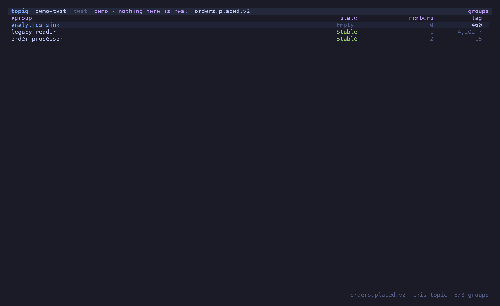
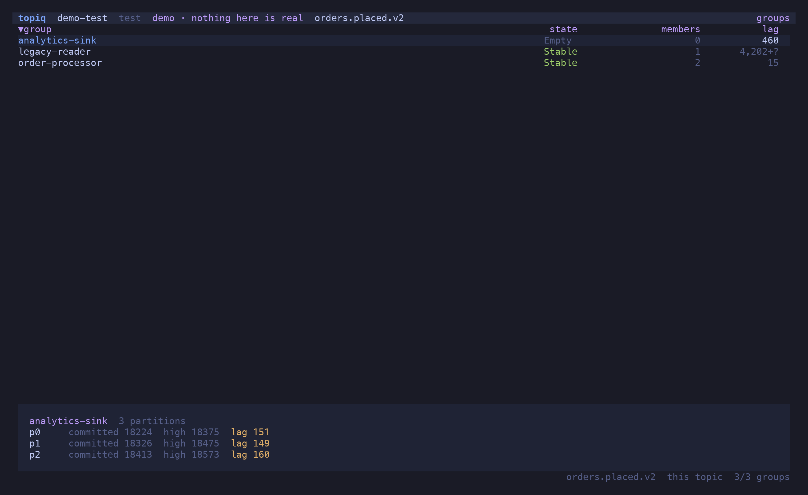
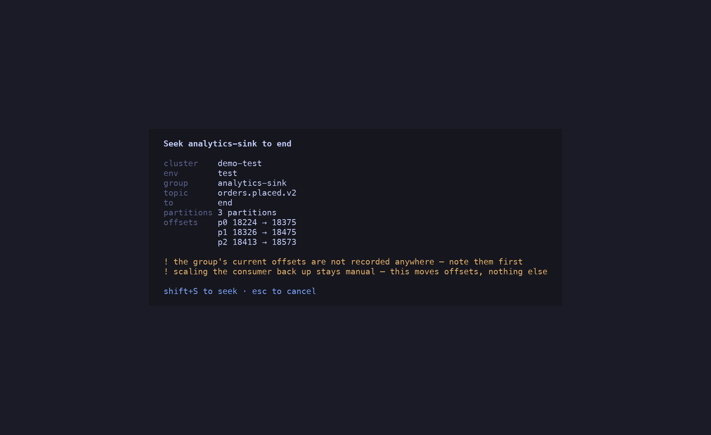
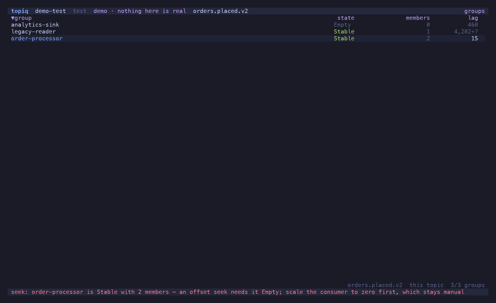

## The group list

`c` on a topic lists every consumer group with its state and member count, then measures
the ones on screen: committed offset, high watermark and lag per partition of the topic.



Two rules keep the numbers honest:

- **`—` means undefined, never zero.** A partition the group has never committed on has no
  lag — reporting `0` would say "caught up" about a consumer that has not started.
- **`+?` marks a floor.** A total over partitions where some are uncommitted is shown as
  `1234+?`: at least this much, possibly more.

`p` or `Enter` opens the per-partition pane, `m` the members — client id, host, and which of
this topic's partitions each one owns. `t` narrows the list to groups actually consuming the
topic; `e` reveals topiq's own ephemeral reader groups (`topiq-read-*`), hidden by default
because they are noise. `s` sorts by name, lag or state; `/` filters; `r` refreshes.



## Seeking offsets

`o` moves a group's committed offsets. Pick a target — the beginning, the end, an offset, or
a timestamp — and `Enter` resolves it **against the broker** so the plan shows the exact
offset per partition it is about to commit, next to the current one:



`⇧S` writes, behind the same gate as every other write: `allow_write`, the confirm dialog,
a typed name for prod.

### The group must be `Empty`

Kafka rejects an offset commit for a group with active members, and a group can rejoin
between the plan being shown and the key being pressed. topiq therefore checks the state
**twice** — when the plan is built, and again at the instant of the write — and refuses a
non-empty group with the same words in both places:

```text
order-processor is Stable with 2 members — an offset seek needs it Empty;
scale the consumer to zero first, which stays manual
```



Scaling the consumer down is not something topiq does. It moves offsets; what runs against
them is yours.

After the write the committed offsets are read back from the broker and shown, so what you
see is what landed, not what was requested.
