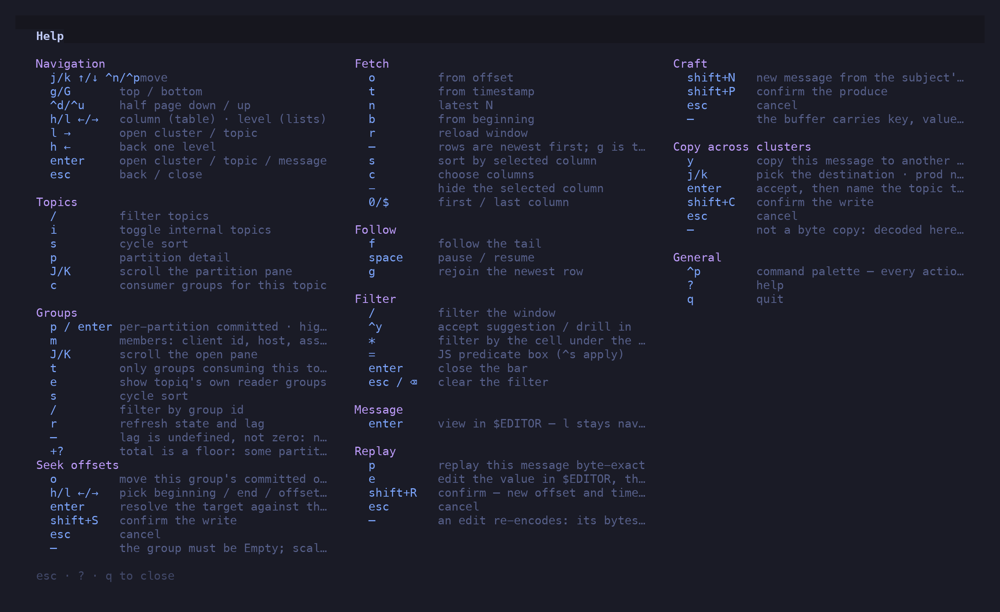
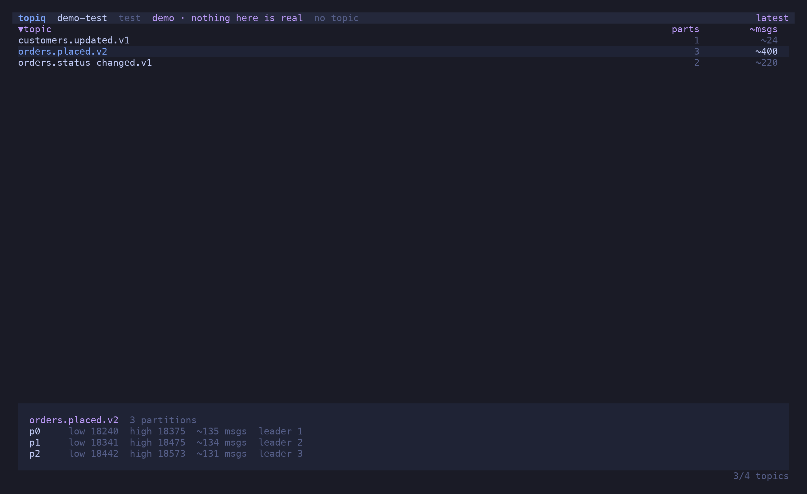
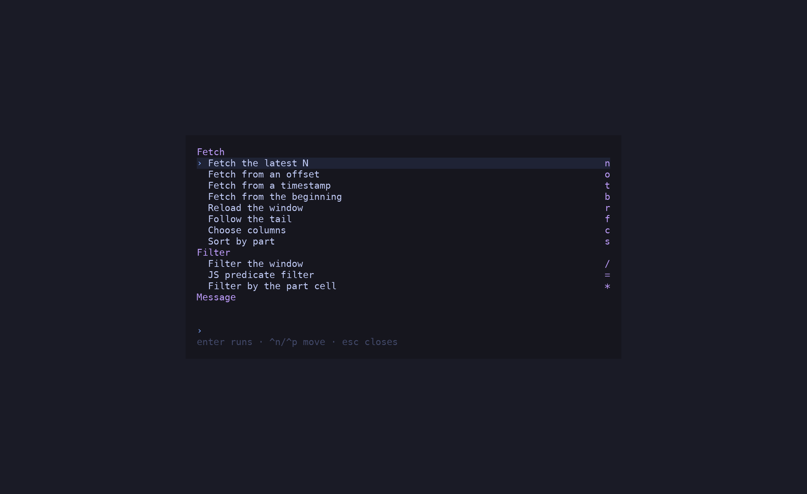

topiq is vim-flavoured: `j`/`k` move, `h`/`l` step across columns or levels, uppercase and
`shift+` confirm the thing that writes. A modified key is never a letter binding — `^p` is
the palette, `p` is replay, and nothing fires both.

Press `?` at any time for this list in the app. `esc`, `?` or `q` closes it.

## Navigation

| Keys | Action |
| --- | --- |
| `j` `k` `↑` `↓` `^n` `^p` | move |
| `g` / `G` | top / bottom — in the message table, newest / oldest |
| `^d` / `^u` | half a page down / up |
| `h` `l` `←` `→` | column (in the table) · level (in lists) |
| `l` `→` | open the cluster / topic under the cursor |
| `h` `←` | back one level |
| `enter` | open cluster / topic / message |
| `esc` | back / close |
| `q` | quit (`^c` too) |

## Topics

| Keys | Action |
| --- | --- |
| `/` | filter topics by name |
| `i` | toggle internal (`_`-prefixed) topics |
| `s` | cycle sort |
| `p` | partition detail pane |
| `J` / `K` | scroll the partition pane |
| `c` | consumer groups for this topic |

## Fetch

| Keys | Action |
| --- | --- |
| `o` | from an offset |
| `t` | from a timestamp (ISO 8601 or epoch millis) |
| `n` | latest N |
| `b` | from the beginning |
| `r` | reload the window |
| `s` | sort by the selected column: asc → desc → window order |
| `c` | choose columns |
| `-` | hide the selected column |
| `0` / `$` | first / last column |

Rows are newest first; `g` is the live edge.

## Follow

| Keys | Action |
| --- | --- |
| `f` | follow the tail |
| `space` | pause / resume — the consumer stays connected |
| `g` | rejoin the newest row after scrolling away |

## Scan

| Keys | Action |
| --- | --- |
| `shift+S` | scan the whole range with the filter — needs a filter; latest N scans from the beginning |
| `shift+S` again | stop while it runs; re-run once it has finished |
| `esc` | leave the hits and return to the window, keeping the filter |

A scan streams every message in the range through the filter and keeps only the hits, so
the range can be the whole topic. Hits stop at the window cap; the header shows how far the
scan got, how fast, and whether it ended, was stopped, or hit the cap.

## Filter

| Keys | Action |
| --- | --- |
| `/` | filter the window |
| `^y` | accept the suggestion / drill into a namespace |
| `*` | filter by the cell under the cursor |
| `=` | JS predicate box (`^s` applies) |
| `enter` | close the bar, keep the filter |
| `esc` / `⌫` on an empty bar | clear the filter |

See [Peek & Filter](/topiq/reference/peek-and-filter/) for the grammar.

## Message

| Keys | Action |
| --- | --- |
| `enter` | view the message in `$EDITOR` — metadata as comments, lossless JSON |

## Replay

| Keys | Action |
| --- | --- |
| `p` | replay this message byte-exact |
| `e` | edit the value in `$EDITOR`, then replay |
| `⇧R` | confirm — new offset and timestamp |
| `esc` | cancel |

An edit re-encodes: its bytes differ from the original, and the dialog says so.

## Craft

| Keys | Action |
| --- | --- |
| `⇧N` | new message from the subject's latest schema |
| `⇧P` | confirm the produce |
| `esc` | cancel |

## Copy across clusters

| Keys | Action |
| --- | --- |
| `y` | copy this message to another cluster |
| `j` / `k` | pick the destination · prod never leads |
| `enter` | accept, then name the topic there |
| `⇧C` | confirm the write |
| `esc` | cancel |

Not a byte copy: decoded here, re-encoded there.

## Groups

| Keys | Action |
| --- | --- |
| `p` / `enter` | per-partition committed · high · lag |
| `m` | members: client id, host, assignment |
| `J` / `K` | scroll the open pane |
| `t` | only groups consuming this topic |
| `e` | show topiq's own reader groups |
| `s` | cycle sort |
| `/` | filter by group id |
| `r` | refresh state and lag |

`—` means lag is undefined (nothing committed), never zero. `+?` on a total means some
partition is uncommitted, so the total is a floor.

## Seek offsets

| Keys | Action |
| --- | --- |
| `o` | move this group's committed offsets |
| `h` / `l` | pick beginning / end / offset / timestamp |
| `enter` | resolve the target against the broker |
| `⇧S` | confirm the write |
| `esc` | cancel |

The group must be `Empty`. Scaling the consumer to zero stays manual.

## Everywhere

| Keys | Action |
| --- | --- |
| `^p` | command palette |
| `?` | this keymap |
| `esc` | close whatever is open |

