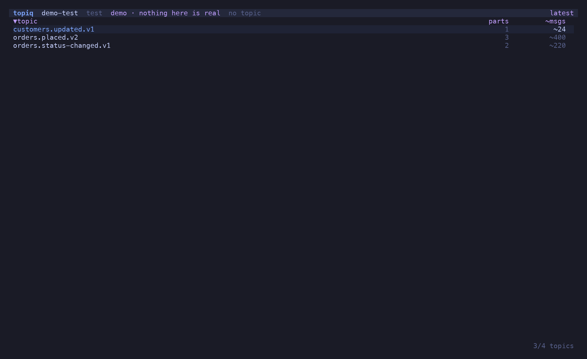
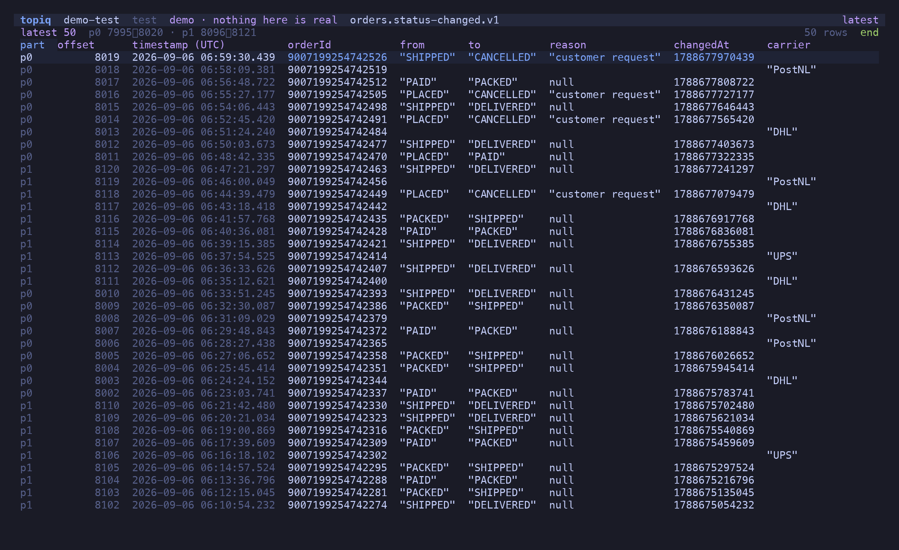
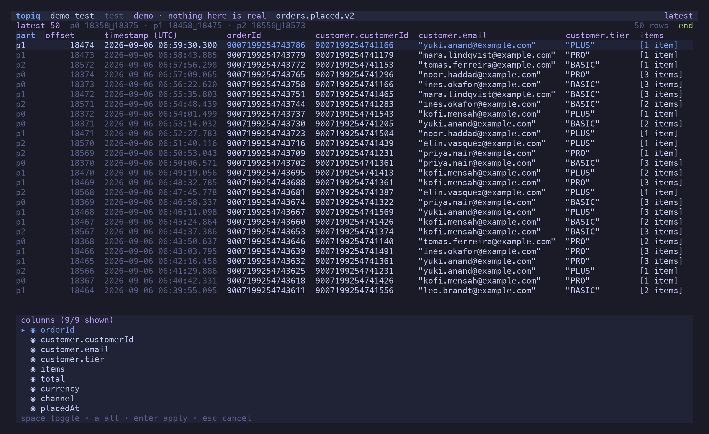
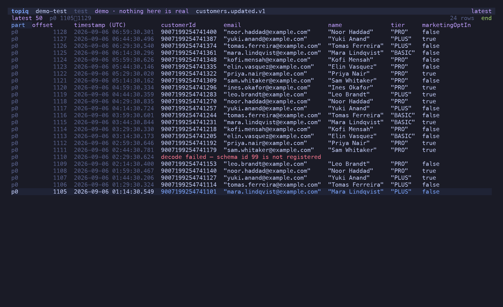
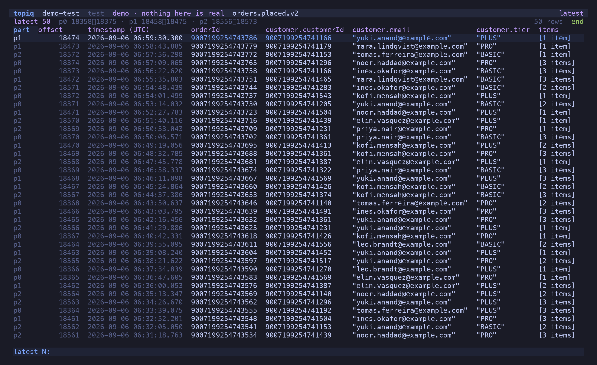
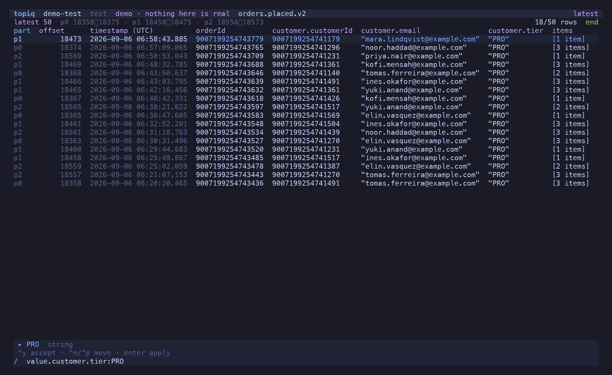
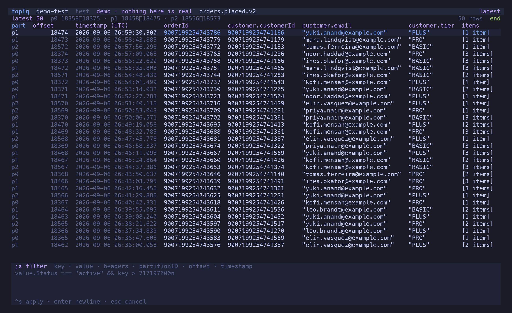

## The topic list

Connect and every topic is listed with its partition count. Watermarks — and the approximate
message count they imply — are measured only for the rows on screen, because a cluster with
two thousand topics cannot afford one request per topic up front. The listing is cached per
cluster so the first paint is instant; the cache is revalidated behind it.

`/` filters by name, `i` shows the `_`-prefixed internal topics, `s` cycles the sort, `p`
opens the partition pane (low, high, count per partition), `c` opens the consumer groups.



## The message table

`Enter` opens the latest 50, **newest first**. Partitions have no global order, so rows sort
by timestamp with partition and offset as tiebreak; row 0 is the newest row everywhere, which
is also where the tail pins.

Columns are inferred from the decoded values — sampled across the whole window, so one odd
message does not dictate the layout. Nested records flatten to dotted paths
(`customer.tier`), arrays summarise (`[3 items]`), and a topic carrying two event types shows
the union of their fields with blanks where a row has none.



Every Avro `long` is a `BigInt`, rendered as bare digits. `Number` never touches an int64
anywhere in topiq — not on decode, not on sort, not on filter, not on re-encode.

`h`/`l` walk the columns, `s` sorts by the selected one (BigInt compares as BigInt, absent
values sort last in both directions), `-` hides it, `c` opens the picker, `0`/`$` jump.



A message that fails to decode — a schema id the registry does not have, a payload that is
not what the schema says — renders as an explicit `decode failed` row with its raw bytes.
Never a crash, never a silently missing row.



### Ranges

Kafka only reads forward, so "the latest N" is watermark arithmetic: high minus N over the
partitions, over-fetched per partition and trimmed. All of it in `BigInt`.

| Key | Range |
| --- | --- |
| `n` | latest N (default 50, cap 10,000) |
| `o` | from an offset, on every partition |
| `t` | from a timestamp — ISO 8601 or epoch millis; a partition with nothing at or after it contributes nothing |
| `b` | from the beginning |
| `r` | reload the same window |

A window is capped at 10,000 rows and says so in the header when it hits the cap.



### `Enter` — the message in `$EDITOR`

There is no detail pane. `Enter` opens the message in `$EDITOR`: partition, offset,
timestamp, schema ids and headers as comments, then the key and the value as lossless JSON
(BigInts as bare digits). Read it, search it, close it.

## Follow

`f` starts a second consumer where the window ended and keeps reading past the high
watermark. Arrivals land at the top. The buffer is bounded at the same 10,000 rows as a
window; past the cap the oldest row is evicted **and counted** in the header, as is anything
dropped under backpressure. `space` pauses without disconnecting — the queue keeps filling
and lands in one batch on resume. `g` rejoins the live edge after scrolling away.

A filter applies to arrivals before they are buffered, so a narrow filter can follow a busy
topic.


## The filter bar

`/` opens it. The grammar is monq's: terms separated by spaces, implicit AND.

| Term | Matches |
| --- | --- |
| `word` | the word anywhere in the rendered value |
| `field:value` | equality, typed by the field's decoded type — `key:12345` matches a BigInt key |
| `field>x` `field<x` `field>=x` | ordering — BigInt, number, string, ISO date |
| `field:10..200` | a range, inclusive |
| `field:/re/` `field:/re/i` | a regex on the rendered form — works on strings, BigInts and subtrees alike |
| `-term` | negation |

Fields are dotted paths over `{key, value, headers, partition, offset, timestamp}`:
`value.customer.tier`, `key`, `partition:2`, `timestamp>2026-09-01`.

```text
/ value.customer.tier:PRO value.total>200
/ value.customer.email:/@example\.com$/ -value.channel:STORE
/ partition:1 offset>18470
```

The filter applies as you type, to the loaded window, and the header shows `matched/total`.
A malformed expression is an inline error under the bar; the previous result set stays on
screen.



### Suggestions

Field names complete from what is actually loaded — the envelope roots plus every inferred
column — one dotted segment at a time. `val` + `^y` gives `value.`, which re-offers only what
lives under it. Once a term has an operator, distinct values sampled from the window are
offered instead. `^n`/`^p` move through the list while it is open; `^y` accepts.


`*` on any cell adds `field:value` for that cell to the bar — the fastest way from "this
row" to "all rows like this".

## The JS escape hatch

`=` opens a predicate box. Write a function of the decoded message:

```js
(m) => m.value.items.length > 2 && m.value.customer.tier !== "BASIC"
```

`m` is `{ key, value, headers, partition, offset, timestamp }` with the decoded forms, BigInts
included. `^s` applies. It runs locally, in-process, on your own credentials — there is no
sandbox because there is nothing to protect you from but yourself. A predicate that throws on
a row skips that row and reports the error once, in the bar; it does not take the table down.


