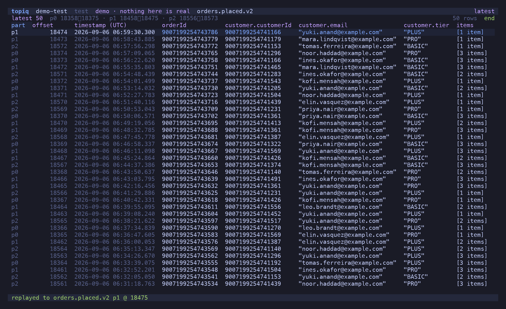

Four ways to put a message on a topic. Every one of them is off by default, goes through the
same gate, and ends in the same confirm dialog.

## The gate

`allow_write` is `false` on every profile until you set it. With it false, `p`, `e`, `⇧N`,
`y` and the offset seek are drawn **disabled with the reason** — in the palette, and on the
status line when pressed:

```text
writes are disabled on orders-prod — allow_write is false in the config
```

Not hidden, and not failing at the broker after the fact.

With it true, a write opens one dialog naming the **action, cluster and environment, topic,
message count** — and for a replay, the message's **age**. Replaying an old snapshot onto a
snapshot-style topic re-applies stale state; that is the realistic way this tool causes
damage, so the dialog makes you read it. Confirmation is a deliberate shifted key (`⇧R`,
`⇧P`, `⇧C`, `⇧S`), never `y`, never `Enter`. A **prod** target — declared `env = "prod"`,
never guessed from a hostname — must be **typed by name**.

The gate is re-evaluated at the instant of the keystroke, not when the dialog opened, so a
config reload in between still counts.


## `p` — replay, byte-exact

The message under the cursor goes back to its own topic: the raw key, the raw value, the raw
headers. **No decode, no re-encode.** The embedded schema id is untouched, so it stays valid;
the bytes are provably identical to the source — the test suite compares them. It lands with
a new offset and timestamp; the original stays where it was.

```text
replayed to orders.placed.v2 p1 @ 18475
```



## `e` — edit, then replay

Decodes the value into `$EDITOR` as lossless JSON, waits, validates your edit against the
**message's own schema id** — not the subject's latest, because editing an old message must
not silently upgrade it — re-encodes, and produces. Validation failures are shown per field
before anything is sent. The dialog states that the bytes will differ from the original, and
why.

## `⇧N` — craft from the schema

Builds a skeleton from the subject's **latest** schema: a `BigInt` placeholder for every
`long`, one sample entry per array and map, union branches listed in a header comment. Opens
it in `$EDITOR` as a `{ key, value, headers }` envelope; `⇧P` encodes against that schema and
produces.

## `y` — copy across clusters

Schema ids are registry-local. A message copied from prod to test carries prod's id, which on
test's registry is a different schema or nothing at all. So a cross-cluster copy is **never**
byte-exact, and topiq never pretends it is: the value is decoded against the **source**
registry and re-encoded against the **destination's**, two registry objects, two schema caches.

The destination bar lists the other profiles — siblings (same `group`) first, prod never the
default row. The topic name is prefix-mapped (`orders.placed.v2` ↔ `test-orders.placed.v2`)
and editable. `Enter` resolves both sides, and the dialog names both subjects, both versions
and both ids before `⇧C` writes:


A destination subject that is missing, or that rejects the message, aborts. Nothing anywhere
falls back to producing the source bytes.

The **destination's** `allow_write` is what gates the copy — it is the cluster being written.
Prod stays read-only as a target even when the source allows writes.

## What a write can and cannot do

- A produce cannot be unproduced. Kafka has no undo, and the dialog says so.
- A replay never modifies or deletes the original.
- topiq never commits an offset for its own reads: windows and tails use ephemeral groups
  with auto-commit off. The only offset write is the explicit seek in
  [Consumer Groups](/topiq/reference/groups/).
